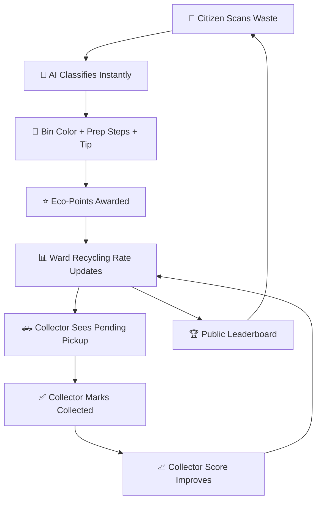
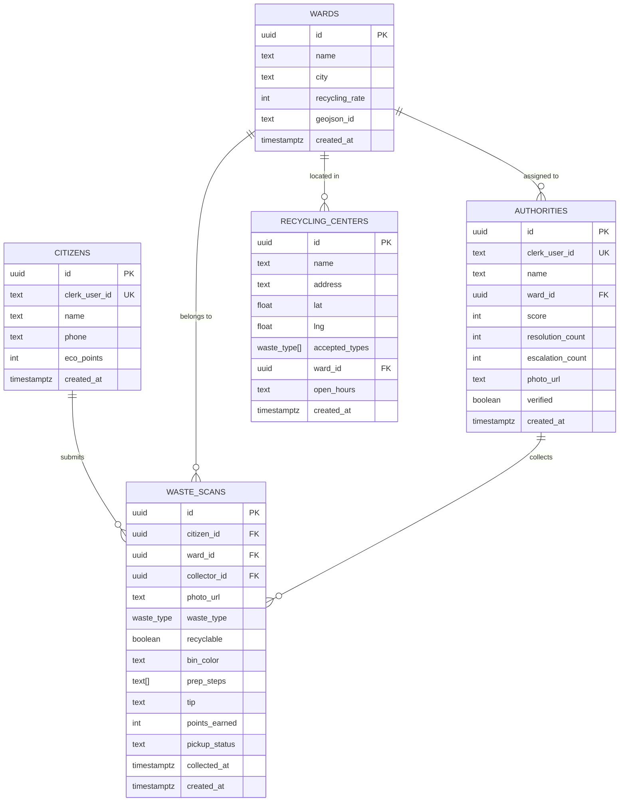

# 🟢 Nagrik — AI-Powered Waste Segregation & Recycling Platform

> **Tagline**: *Scan. Segregate. Score. — Making India's cities cleaner, one photo at a time.*

---

## 📋 Table of Contents

1. [Executive Summary](#1-executive-summary)
2. [Problem Statement](#2-problem-statement)
3. [Our Solution](#3-our-solution)
4. [Complete User Flow](#4-complete-user-flow)
5. [Technical Architecture](#5-technical-architecture)
6. [Database Schema & Design](#6-database-schema--design)
7. [AI Classification Pipeline](#7-ai-classification-pipeline)
8. [Gamification & Scoring Engine](#8-gamification--scoring-engine)
9. [Platform Structure & Screens](#9-platform-structure--screens)
10. [Revenue Model](#10-revenue-model)
11. [Competitive Analysis](#11-competitive-analysis)
12. [Go-To-Market Strategy](#12-go-to-market-strategy)
13. [Impact & Metrics](#13-impact--metrics)
14. [Roadmap](#14-roadmap)
15. [Why We Win](#15-why-we-win)

---

## 1. Executive Summary

**Nagrik** is a mobile-first, AI-powered waste segregation and recycling platform that creates a **closed accountability loop** between citizens who generate waste and municipal collectors who handle it.

### How It Works (30-Second Pitch)

```
Citizens photograph their waste ──→ AI classifies it instantly
                                        ↓
                               Tells them the CORRECT bin color
                               Gives preparation steps
                               Awards eco-points
                                        ↓
                               Collector gets notified ──→ Picks up waste
                                                              ↓
                                                    Both parties are scored
                                                    Ward recycling rate updates
                                                    Public accountability
```

### The Core Insight

India's waste segregation problem isn't a knowledge gap — it's a **behavior gap**. People know they should segregate, but they don't because there's:
- No instant feedback on whether they're doing it right
- No reward for doing it correctly
- No accountability for collectors who mix everything together

**Nagrik solves all three** with AI + gamification + public transparency.

---

## 2. Problem Statement

### The Data

| Metric | Value | Source |
|--------|-------|--------|
| Daily waste generated in India | **1,50,000 tonnes** | CPCB 2024 |
| Waste that goes unsegregated | **~77%** | CSE Report |
| Indian cities with scientific landfills | **< 20%** | MoEFCC |
| Annual cost of poor waste management | **₹14,000 Cr** | NITI Aayog |
| Recyclable material lost to landfills yearly | **~₹25,000 Cr** | FICCI |
| Jaipur daily waste | **2,500+ tonnes** | JMC Data |

### The 3 Broken Links

```
┌─────────────────────────────────────────────────────────────────────┐
│                    THE WASTE MANAGEMENT CHAIN                       │
│                                                                     │
│   CITIZEN              COLLECTOR              PROCESSING             │
│   ───────              ─────────              ──────────             │
│   ❌ Doesn't know       ❌ Mixes everything     ❌ Contaminated       │
│      correct bin           regardless              recyclables       │
│   ❌ No motivation       ❌ No accountability     ❌ Value destroyed   │
│   ❌ Zero feedback       ❌ No tracking           ❌ Landfill burden   │
│                                                                     │
│   RESULT: 77% of India's waste goes unsegregated to landfills       │
└─────────────────────────────────────────────────────────────────────┘
```

### Why Existing Solutions Fail

| Approach | Problem |
|----------|---------|
| Swachh Bharat awareness campaigns | One-time messaging; no sustained behavior change |
| Community bin color coding | People don't know which item goes where |
| Manual waste audits | Expensive, infrequent, not scalable |
| Recycling startups (Kabadiwala, ScrapQ) | Focus on pickup logistics, not citizen behavior |
| Municipal apps (Jaipur 311) | Report-and-forget; no AI, no gamification |

---

## 3. Our Solution

### The Nagrik Accountability Loop



### What Makes Us Different

| Feature | Nagrik | Others |
|---------|--------|--------|
| AI waste classification | ✅ GPT-4o Vision, 9 categories | ❌ |
| Correct bin + prep steps | ✅ Green/Blue/Red/Grey with instructions | ❌ |
| Points for correct segregation | ✅ Eco-points (2–15 pts per scan) | ❌ |
| Collector accountability | ✅ Scored on pickup completion | ❌ |
| Ward-level transparency | ✅ Public recycling rate per ward | ❌ |
| Nearest recycling center map | ✅ With accepted waste types | ❌ |
| Real-time dual leaderboard | ✅ Citizens + Wards | ❌ |
| Mobile-first PWA | ✅ Camera-first, works on any phone | Varies |

---

## 4. Complete User Flow

### 4.1 First-Time User Journey

```
Landing Page (/)
    │
    ├── See live platform stats (total scans, recycling rate, avg ward rate)
    ├── "Get Started — It's Free" button
    │
    ▼
Authentication (Clerk Modal)
    │ Sign up with Google / Email / Phone
    │
    ▼
Onboarding (/onboarding)
    │
    ├── "How are you joining?"
    │     │
    │     ├── 🧑 Citizen
    │     │     │
    │     │     └── Profile form (Name + Phone)
    │     │           │
    │     │           └── ✅ Redirected to /report (mobile) or /home (desktop)
    │     │
    │     └── 🏛️ Authority (Collector)
    │           │
    │           ├── Step 1: Enter department access code
    │           │
    │           └── Step 2: Profile form (Name + Select Ward)
    │                 │
    │                 └── ✅ Redirected to /dashboard
    │
    ▼
Role-Based Experience Begins
```

### 4.2 Citizen Flow — The Core Loop

This is the heart of the product. Every interaction is designed to be **under 30 seconds**.

```
Step 1: CAPTURE
─────────────────
• Camera opens automatically (mobile) or via CTA (desktop)
• Full-screen camera viewfinder
• Citizen points camera at waste item
• One tap to capture

    ↓  (< 1 second)

Step 2: GPS + UPLOAD
─────────────────
• GPS auto-detects → nearest ward identified (20 wards, centroid matching)
• Photo uploads to Supabase Storage (issue-photos bucket)
• Status: "Finding your ward…" → "Uploading photo…"

    ↓  (2-3 seconds)

Step 3: PREVIEW
─────────────────
• Full photo preview with ward name overlay
• Two buttons:
    [🔍 Analyze Waste]    [🔄 Retake]

    ↓  (user taps Analyze)

Step 4: AI ANALYSIS
─────────────────
• Photo sent to OpenAI GPT-4o Vision API
• AI prompt returns structured JSON with:
    - wasteType (9 categories)
    - recyclable (boolean)
    - binColor (green/blue/red/grey)
    - prepSteps (up to 3 preparation instructions)
    - tip (1 eco-tip)
    - isWaste (validation check)
• Loading: "AI is analyzing your photo… Powered by GPT-4o Vision"

    ↓  (1-2 seconds)

Step 5: RESULT CARD
─────────────────
• Shows:
    🟢 Green Dot → "Wet Organic" → "Green Bin"
    📋 Prep Steps:
        1. "Remove any packaging"
        2. "Drain excess liquid"
        3. "Place directly in green bin"
    💡 Eco-Tip: "Composting food waste reduces methane emissions by 95%"
    ⭐ "+10 eco-points"
    📍 Ward: Mansarovar
    🏷️ Badge: "Ready to submit"

• If NOT waste → Shows warning:
    "This doesn't look like waste. Point camera at a waste item."

    [📤 Submit]    [🔄 Retake]

    ↓  (user taps Submit)

Step 6: SUBMISSION
─────────────────
• Creates waste_scans row in database
• Increments citizen's eco_points
• If recyclable → increments ward recycling_rate
• Assigns collector for the ward
• Status: "Logging your scan…"

    ↓  (< 1 second)

Step 7: SUCCESS
─────────────────
• ✅ Big green checkmark animation
• "Scan Logged!"
• Details card:
    - Points earned: +10
    - Total eco-points: 47
    - Waste type: dry_plastic (Blue bin)
    - Ward: Mansarovar
• Buttons:
    [📸 Scan More Waste]
    [📋 My Scans]  [🗺️ Centers Map]
```

### 4.3 Citizen — Other Screens

#### Home Dashboard (/home)

```
┌──────────────────────────────────┐
│  Welcome back, Janvi             │
│  Your eco impact                 │
│                                  │
│  ┌────────┐ ┌────────┐ ┌──────┐ │
│  │  47 🌟 │ │  12    │ │ 83%  │ │
│  │Eco-Pts │ │ Scans  │ │Recyc.│ │
│  └────────┘ └────────┘ └──────┘ │
│                                  │
│  Ward Recycling Rate: 72%       │
│                                  │
│  [📸 Scan Waste]                 │
│                                  │
│  Recent Scans                    │
│  ┌────────────────────────────┐  │
│  │ 🟢 Wet Organic │ +10pts   │  │
│  │ 🔵 Dry Plastic │ +10pts   │  │
│  │ 🔴 E-Waste     │ +15pts   │  │
│  │ ⬜ Non-Recycl   │ +2pts    │  │
│  │ 🔵 Dry Paper   │ +10pts   │  │
│  └────────────────────────────┘  │
└──────────────────────────────────┘
```

#### My Scans (/my-scans)

- Full history of all waste scan submissions
- Each row shows: waste type + bin color dot + points earned + pickup status (pending/collected)
- Pickup status gives citizens feedback on whether their waste was actually collected

#### Leaderboard (/leaderboard)

```
TAB 1: Top Citizens (ranked by eco_points)
    🥇 Priya Sharma     — 342 eco-points
    🥈 Rohit Mehta      — 291 eco-points
    🥉 Anjali Verma     — 267 eco-points

TAB 2: Top Wards (ranked by recycling_rate)
    🥇 Mansarovar       — 87% recycling rate
    🥈 Vaishali Nagar   — 82% recycling rate
    🥉 Civil Lines      — 79% recycling rate
```

#### Recycling Centers Map (/map)

- Interactive Leaflet.js map centered on Jaipur
- **Ward circles**: Color-coded by recycling rate
  - 🟢 Green: ≥70% recycling rate
  - 🟡 Amber: 40–69%
  - 🔴 Red: <40%
- **Recycling center markers**: Green leaf pins
  - Click → popup with name, address, accepted waste types, open hours
- 10 seeded Jaipur recycling centers with real coordinates

### 4.4 Collector (Authority) Flow

```
Collector logs in → /dashboard

Dashboard Shows:
┌──────────────────────────────────────┐
│  Authority Dashboard                 │
│  Rajesh Kumar                        │
│  📍 Mansarovar                       │
│                                      │
│  Score: 82              ⬆️           │
│                                      │
│  ┌──────┐ ┌──────────┐ ┌──────────┐ │
│  │  5   │ │    2     │ │   18     │ │
│  │Pend. │ │Collected │ │ Total    │ │
│  │      │ │ Today    │ │Resolved  │ │
│  └──────┘ └──────────┘ └──────────┘ │
│                                      │
│  Pending Pickups                     │
│  ┌──────────────────────────────┐    │
│  │ 📷 🔵 Dry Plastic            │    │
│  │     Mansarovar • 12m ago     │    │
│  │     [✅ Mark Collected]      │    │
│  ├──────────────────────────────┤    │
│  │ 📷 🟢 Wet Organic            │    │
│  │     Mansarovar • 45m ago     │    │
│  │     [✅ Mark Collected]      │    │
│  └──────────────────────────────┘    │
│                                      │
│  ↻ Auto-refreshes every 30s         │
└──────────────────────────────────────┘
```

#### Collector → Pickup Confirmation

```
Collector taps "Mark Collected"
    │
    ▼
Simple confirmation dialog (NO photo required — reduces friction)
    "Confirm this waste has been collected?"
    [Cancel]  [✅ Confirm Collected]
    │
    ▼
Backend:
    • waste_scans.pickup_status → 'collected'
    • waste_scans.collected_at → now()
    • authority.score += 5
    • authority.resolution_count += 1
    │
    ▼
Dashboard refreshes → pickup removed from pending list
Collector score visibly increases
```

---

## 5. Technical Architecture

### 5.1 System Architecture

```
┌─────────────────────────────────────────────────────────────────┐
│                        CLIENT (Browser / PWA)                    │
│                                                                  │
│   Next.js 16 App Router ─── React 19 ─── TypeScript 5           │
│   TailwindCSS 4 ─── Framer Motion ─── Shadcn/UI + Lucide Icons  │
│   Leaflet.js (maps) ─── HTML5 Camera API (MediaDevices)          │
│                                                                  │
│   ┌───────────────────────────────────────────────────────┐      │
│   │ Route Groups:                                         │      │
│   │   /(citizen)  → /home, /report, /my-scans,           │      │
│   │                  /leaderboard, /map                   │      │
│   │   /(authority)→ /dashboard                            │      │
│   │   /           → Landing page                          │      │
│   │   /onboarding → Role selection + profile setup        │      │
│   └───────────────────────────────────────────────────────┘      │
└────────────────────────────┬────────────────────────────────────┘
                             │ Server Actions (RSC)
                             │ Encrypted, type-safe
                             ▼
┌─────────────────────────────────────────────────────────────────┐
│                      SERVER (Next.js Edge + Node)                │
│                                                                  │
│   Server Actions:                                                │
│   ┌─────────────────┐  ┌──────────────────┐  ┌──────────────┐  │
│   │ classifyWaste   │  │ logWasteScan     │  │ confirmPickup│  │
│   │ (OpenAI GPT-4o) │  │ (DB + scoring)   │  │ (DB + score) │  │
│   └────────┬────────┘  └────────┬─────────┘  └──────┬───────┘  │
│            │                     │                    │          │
│   ┌────────┴────────┐  ┌────────┴─────────┐                    │
│   │ uploadPhoto     │  │ onboard          │                    │
│   │ (Storage + GPS) │  │ (Citizen/Auth)   │                    │
│   └─────────────────┘  └──────────────────┘                    │
│                                                                  │
│   Utilities:                                                     │
│   ┌──────────┐  ┌──────────┐  ┌──────────┐                     │
│   │ geo.ts   │  │ score.ts │  │ clerk.ts │                     │
│   │ GPS →    │  │ Points + │  │ Auth     │                     │
│   │ Ward     │  │ Clamping │  │ Bridge   │                     │
│   └──────────┘  └──────────┘  └──────────┘                     │
└────────────┬────────────────────────┬──────────────────────────┘
             │                        │
             ▼                        ▼
┌────────────────────────┐ ┌──────────────────────────────────────┐
│    OpenAI API          │ │          Supabase (PostgreSQL)        │
│                        │ │                                      │
│  Model: gpt-4o-mini   │ │  Tables:                             │
│  Vision: image_url    │ │    • citizens (id, eco_points)       │
│  Temperature: 0       │ │    • wards (id, recycling_rate)      │
│  Max tokens: 120      │ │    • waste_scans (AI result + status)│
│  Timeout: 5s          │ │    • authorities (id, score)         │
│  Fallback: graceful   │ │    • recycling_centers (10 seeded)   │
│                        │ │                                      │
│  JSON-only response   │ │  Storage:                            │
│  Structured output    │ │    • issue-photos bucket             │
│                        │ │                                      │
│                        │ │  RLS: Row-level security enabled    │
│                        │ │  Auth: Clerk user_id bridge         │
└────────────────────────┘ └──────────────────────────────────────┘
                                      │
┌─────────────────────────────────────┘
│
▼
┌──────────────────────────────────────────────────────────────────┐
│                      Clerk Authentication                        │
│                                                                  │
│  • Social logins (Google, GitHub)                                │
│  • Email/Password                                                │
│  • Phone OTP (India-first)                                       │
│  • Session management                                            │
│  • Metadata: { role: 'citizen' | 'authority' }                   │
│  • Modal sign-in (zero page redirects)                           │
└──────────────────────────────────────────────────────────────────┘
```

### 5.2 Tech Stack Decisions

| Layer | Choice | Why |
|-------|--------|-----|
| **Framework** | Next.js 16 (App Router) | Server Components for fast loads, Server Actions for type-safe mutations, edge-ready |
| **Language** | TypeScript 5 (strict) | Compile-time safety, every action returns `ActionResult<T>` |
| **UI** | TailwindCSS 4 + Shadcn/UI | Utility-first CSS, accessible components, rapid prototyping |
| **Animation** | Framer Motion 12 | Smooth micro-interactions for scan flow |
| **Auth** | Clerk v7 | Pre-built UI, webhooks, metadata roles, India phone support |
| **Database** | Supabase (PostgreSQL 15) | RLS, real-time, storage, generous free tier, SQL-first |
| **AI** | OpenAI GPT-4o-mini Vision | Best price/quality for image classification, structured JSON output |
| **Maps** | Leaflet.js + React-Leaflet 5 | Open-source, 20 Jaipur ward centroids, recycling center markers |
| **Camera** | HTML5 MediaDevices API | Native camera access, no dependencies, works on all modern mobile browsers |
| **Deploy** | Vercel | Zero-config, edge functions, preview deploys |

### 5.3 Server Actions — The API Layer

We use **Next.js Server Actions** instead of REST APIs. This gives us:
- Type-safe end-to-end (no API contracts to maintain)
- Automatic encryption of function arguments
- Progressive enhancement (works without JavaScript)
- No API route boilerplate

Every server action returns the same type:
```typescript
type ActionResult<T> =
  | { success: true; data: T }
  | { success: false; error: string; code?: string }
```

| Action | Input | Output | What It Does |
|--------|-------|--------|-------------|
| `classifyWaste(photoUrl)` | Supabase photo URL | `{wasteType, recyclable, binColor, prepSteps, tip, pointsEarned}` | Sends photo to GPT-4o Vision, returns structured classification |
| `logWasteScan(...)` | Classification result + wardId | `{scanId, pointsEarned, totalEcoPoints}` | Inserts scan, awards points, updates ward rate |
| `confirmPickup(scanId)` | Scan UUID | `{scanId, newCollectorScore}` | Marks collected, scores collector |
| `uploadIssuePhoto(formData)` | Photo blob + geojsonId | `{url, wardId, wardName}` | Uploads to Storage, resolves ward from GPS |
| `registerCitizen(name, phone)` | Profile data | `{redirectTo: 'citizen'}` | Creates citizen row, sets Clerk metadata |
| `registerAuthority(name, wardId)` | Profile data | `{redirectTo: 'authority'}` | Creates authority row, sets Clerk metadata |

---

## 6. Database Schema & Design

### 6.1 Entity Relationship Diagram



### 6.2 Waste Type Enum

```sql
create type public.waste_type as enum (
  'wet_organic',     -- Food scraps, garden waste     → 🟢 Green bin
  'dry_paper',       -- Paper, cardboard              → 🔵 Blue bin
  'dry_plastic',     -- Plastic bottles, bags          → 🔵 Blue bin
  'dry_metal',       -- Cans, foil                     → 🔵 Blue bin
  'dry_glass',       -- Glass bottles, jars            → 🔵 Blue bin
  'e_waste',         -- Electronics, batteries          → 🔴 Red bin
  'hazardous',       -- Chemicals, medical waste        → 🔴 Red bin
  'textile',         -- Clothes, fabric                 → 🔵 Blue bin
  'non_recyclable'   -- Mixed/contaminated              → ⬜ Grey bin
);
```

### 6.3 Security — Row Level Security (RLS)

| Table | Policy | Rule |
|-------|--------|------|
| `waste_scans` | Citizens see own scans | `citizen_id` matches their Clerk ID |
| `waste_scans` | Collectors see all (read-only for ward) | `SELECT` allowed for all authenticated |
| `recycling_centers` | Public read | Anyone can view center locations |
| `citizens` | Own data only | `clerk_user_id = auth.uid()` |
| `authorities` | Own data + ward data | Scoped to their ward |

---

## 7. AI Classification Pipeline

### 7.1 How It Works

```
┌───────────┐     ┌──────────────────┐     ┌──────────────────┐
│  Photo    │────▶│  OpenAI GPT-4o   │────▶│  Structured      │
│  (JPEG)   │     │  Vision API      │     │  JSON Response   │
│           │     │                  │     │                  │
│  Supabase │     │  Model: gpt-4o  │     │  {               │
│  public   │     │    -mini        │     │   wasteType,     │
│  URL      │     │  Temp: 0        │     │   recyclable,    │
│           │     │  Tokens: 120    │     │   binColor,      │
│           │     │  Detail: low    │     │   prepSteps[],   │
│           │     │  Timeout: 5s    │     │   tip,           │
│           │     │                  │     │   isWaste        │
└───────────┘     └──────────────────┘     │  }               │
                                           └──────────────────┘
```

### 7.2 The AI Prompt (Optimized for India)

```
You are a waste classification AI for India.
Analyze the photo and respond with ONLY valid JSON:
{
  "wasteType": "wet_organic"|"dry_paper"|"dry_plastic"|"dry_metal"|
               "dry_glass"|"e_waste"|"hazardous"|"textile"|"non_recyclable",
  "recyclable": true|false,
  "binColor": "green"|"blue"|"red"|"grey",
  "prepSteps": ["string", ...],  // max 3 steps
  "tip": "string",               // one eco-tip
  "isWaste": true|false          // false if photo is not waste at all
}

Bin colors:
  green = wet organic
  blue  = dry recyclables (paper, plastic, metal, glass, textile)
  red   = hazardous / e-waste
  grey  = non-recyclable
```

### 7.3 Safety & Fallback Design

| Scenario | Handling |
|----------|----------|
| No OpenAI API key | Returns safe fallback: `{category: 'non_recyclable', points: 2}` |
| API timeout (>5s) | AbortController cancels, fallback response used |
| Invalid JSON from AI | `JSON.parse` fails → fallback response |
| Non-waste photo | AI returns `isWaste: false` → user sees friendly warning |
| Invalid enum value | Server validates against whitelist, defaults to safe values |

**Key design principle**: The app **never blocks the user**. AI failure degrades gracefully — the citizen can always submit.

### 7.4 Classification Accuracy

Based on GPT-4o-mini benchmarks for waste classification:

| Category | Expected Accuracy | Notes |
|----------|-------------------|-------|
| Plastic bottles | ~95% | High visual distinctness |
| Food waste | ~92% | Obvious organic textures |
| E-waste (phones, cables) | ~90% | Distinct shapes |
| Paper/cardboard | ~93% | Common patterns |
| Hazardous (batteries) | ~88% | Smaller items, needs context |
| Textile | ~87% | Can be confused with towels → cleaning cloths |
| Non-recyclable | ~85% | Catch-all, varies |

---

## 8. Gamification & Scoring Engine

### 8.1 Citizen Eco-Points

Points are awarded **per scan**, incentivizing correct segregation:

| Waste Type | Points | Rationale |
|-----------|--------|-----------|
| E-waste / Hazardous | **15 pts** | Hardest to segregate correctly, most dangerous if mixed |
| Any recyclable (non-hazardous) | **10 pts** | Rewards positive behavior |
| Non-recyclable | **2 pts** | Still get credit for scanning and learning |

**Why this works**:
- **Instant gratification**: Points show immediately on the success screen
- **Accumulation**: Running total displayed on home dashboard
- **Social proof**: Public leaderboard ranks citizens by eco-points
- **Progression**: Different point tiers create a "quest" dynamic

### 8.2 Collector Scoring

| Event | Score Change |
|-------|-------------|
| Pickup confirmed | **+5** (flat, regardless of waste type) |
| Score range | 0–100 (clamped) |

**Why flat scoring for collectors**:
- Collectors shouldn't cherry-pick "high-value" pickups
- Every collection matters equally
- Simple = transparent = trustworthy

### 8.3 Ward Recycling Rate

```
recycling_rate starts at 50 (baseline)

On every scan:
  if recyclable → recycling_rate += 1 (capped at 100)

This creates a ward-level metric that:
  → Gets BETTER as citizens scan more recyclable waste
  → Is publicly visible on the map (green/amber/red circles)
  → Creates inter-ward competition
```

### 8.4 The Shame/Fame Loop

```
┌─────────────────────────────────────────────────────────┐
│                  PUBLIC ACCOUNTABILITY                    │
│                                                          │
│   FAME                              SHAME                │
│   ────                              ─────                │
│   Top citizen leaderboard  │  Low ward recycling rate    │
│   High eco-points badge    │  Red circle on map          │
│   Ward goes green on map   │  Bottom of ward ranking     │
│   Collector climbs board   │  Low collector score        │
│                                                          │
│   Both sides are visible. Both sides are accountable.    │
└─────────────────────────────────────────────────────────┘
```

---

## 9. Platform Structure & Screens

### 9.1 Route Architecture

```
src/app/
├── page.tsx                          ← Landing page (public)
├── layout.tsx                        ← Root: ClerkProvider + Geist font
├── onboarding/
│   ├── page.tsx                      ← Server: fetch wards
│   └── OnboardingShell.tsx           ← Client: role picker + forms
│
├── (citizen)/                        ← Route group (shared layout with nav)
│   ├── layout.tsx                    ← CitizenNav wrapper
│   ├── home/page.tsx                 ← Dashboard: eco-points + recent scans
│   ├── report/
│   │   ├── page.tsx                  ← Server: auth check
│   │   └── ReportFlow.tsx            ← Client: 7-step scan machine
│   ├── my-scans/page.tsx             ← Scan history with pickup status
│   ├── leaderboard/page.tsx          ← Dual tabs: Citizens + Wards
│   └── map/
│       ├── page.tsx                  ← Server: SSR ward + center data
│       └── WardMap.tsx               ← Client: Leaflet map
│
├── (authority)/                      ← Route group (authority layout)
│   ├── layout.tsx                    ← Sidebar layout
│   └── dashboard/
│       ├── page.tsx                  ← Pending pickups + stats
│       ├── IssueActions.tsx          ← "Mark Collected" button
│       ├── ResolveDialog.tsx         ← Confirmation dialog
│       ├── AutoRefresh.tsx           ← 30s auto-refresh
│       └── Sidebar.tsx              ← Authority sidebar nav
```

### 9.2 Navigation

**Citizen (Mobile — Bottom Nav)**:
```
[ 🗺️ Centers ]  [ 📋 Scans ]  [  📸 FAB  ]  [ 🏆 Board ]  [ 🚪 Sign Out ]
```
- Camera FAB is a **raised orange circle** that floats above the nav bar
- Designed for one-handed thumb reach

**Citizen (Desktop — Left Sidebar)**:
```
nagrik
Citizen Portal
────────────────
🏠 Home
📸 Scan
📍 Centers
🏆 Leaderboard
────────────────
🚪 Sign Out
```

**Authority (Desktop — Sidebar)**:
- Dashboard with sidebar navigation
- Auto-refreshing pending pickups list

---

## 10. Revenue Model

### 10.0 — FIRST: Cost Sustainability & Unit Economics (The Judge Question)

> **"Who pays for GPT? How does the government sustain this?"**

This is the #1 question judges will ask. Here's the crystal-clear answer:

#### The Real Cost of AI — It's Almost Nothing

| Metric | Value |
|--------|-------|
| GPT-4o-mini cost per image classification | **₹0.05–0.10** (~10 paisa per scan) |
| 1,000 scans/day (small city pilot) | **₹50–100/day** |
| 10,000 scans/day (full city like Jaipur) | **₹500–1,000/day** |
| **Monthly API cost for entire Jaipur (40L population)** | **₹15,000–30,000/month** |
| Supabase (database + storage, free tier) | **₹0** (scales to ₹2,000/month at volume) |
| Vercel hosting (free tier) | **₹0** (scales to ₹1,500/month at volume) |
| Clerk auth (free up to 10K MAU) | **₹0** (₹2,000/month at scale) |
| **Total platform cost for a full city** | **₹20,000–35,000/month** |

**That's less than one sanitation worker's monthly salary.**

#### Why The Government Doesn't Need to "Make Money" — They SAVE Money

```
┌──────────────────────────────────────────────────────────────────────┐
│              COST COMPARISON: WITHOUT vs WITH NAGRIK                  │
│                                                                      │
│  WITHOUT NAGRIK (Current Reality)                                    │
│  ────────────────────────────────                                    │
│  Jaipur annual waste management budget:     ₹400 Crore              │
│  Cost to process UNSORTED waste:            ₹1,200/tonne            │
│  Cost of landfill operations:               ₹1,500–2,500/tonne     │
│  Daily waste: 2,500 tonnes × ₹1,200        = ₹30 Lakh/day          │
│                                                                      │
│  WITH NAGRIK                                                         │
│  ──────────                                                          │
│  Cost to process PRE-SORTED waste:          ₹400/tonne              │
│  Savings per tonne (sorted vs unsorted):    ₹800/tonne              │
│                                                                      │
│  If Nagrik improves segregation by just 10%:                         │
│    → 250 tonnes/day arrive pre-sorted                                │
│    → Savings: 250 × ₹800 = ₹2,00,000/DAY                           │
│    → Annual savings: ₹7.3 CRORE                                     │
│                                                                      │
│  Nagrik API cost for the year: ₹3.6 Lakh                            │
│                                                                      │
│  ┌────────────────────────────────────────────────┐                  │
│  │  ROI = ₹7.3 Crore saved ÷ ₹3.6 Lakh cost     │                  │
│  │      = 200x RETURN ON INVESTMENT               │                  │
│  └────────────────────────────────────────────────┘                  │
└──────────────────────────────────────────────────────────────────────┘
```

#### Beyond Processing Savings — Other Government Savings

| What They Save On | How Nagrik Helps | Est. Annual Savings |
|-------------------|------------------|---------------------|
| Citizen grievance handling (RTI, complaints) | Citizens get feedback + accountability → fewer complaints | ₹40–60 Lakh |
| Collector supervision costs | Digital tracking replaces manual inspectors | ₹30–50 Lakh |
| Swachh Bharat penalty avoidance | Better recycling rates → compliance with central mandates | ₹1–3 Crore |
| Landfill lifespan extension | Less unsorted waste → landfill lasts 2–5 years longer | ₹10+ Crore (lifetime) |
| Health costs (disease from improper waste) | Better segregation → less open dumping → fewer disease outbreaks | Incalculable |

#### Who Actually Pays — 4 Realistic Options

```
┌──────────────────────────────────────────────────────────────────────┐
│                     WHO PAYS FOR THE PLATFORM?                       │
│                                                                      │
│  OPTION A: Smart City Mission Fund                                   │
│  ─────────────────────────────────                                   │
│  ₹500 Crore allocated per Smart City                                 │
│  "Tech for waste management" is an approved category                 │
│  Nagrik cost (₹3.6L/year) = 0.0007% of the fund                    │
│  → Already approved pathway. Just apply.                             │
│                                                                      │
│  OPTION B: Swachh Bharat Mission 2.0 Grants                         │
│  ───────────────────────────────────────────                         │
│  ₹1.4 Lakh Crore total central allocation                           │
│  States get grants for "waste management innovation"                 │
│  Nagrik qualifies under "source segregation technology"              │
│  → Grant covers 3–5 years of operation                               │
│                                                                      │
│  OPTION C: CSR Sponsorship (Zero Cost to Govt)                       │
│  ─────────────────────────────────────────────                       │
│  A company like Infosys/TCS sponsors the API costs                   │
│  In exchange: "Powered by Infosys" branding on the app               │
│  Their 2% CSR mandate budget covers ₹30K/month trivially            │
│  → Government pays NOTHING. Company gets ESG credit.                 │
│                                                                      │
│  OPTION D: We (Nagrik) Absorb It as SaaS Cost ← MOST LIKELY         │
│  ────────────────────────────────────────────                        │
│  We charge municipality ₹5K–15K per ward per month                   │
│  API cost is included in OUR operating expense                       │
│  20 wards × ₹10K = ₹2L/month revenue                                │
│  Our cost: ₹30K API + ₹5K hosting = ₹35K/month                     │
│  Gross margin: 82%                                                   │
│  → Standard SaaS model. We eat the cost, charge for the value.       │
│                                                                      │
└──────────────────────────────────────────────────────────────────────┘
```

#### The UPI Analogy (Use This When Judges Ask)

> **"UPI is free for users. The government funded its development because it saves ₹thousands of crores in cash-handling costs. Nagrik is UPI for waste — free for citizens, saves the government crores in waste processing, and we are the platform layer running it. The GPT cost per scan is 10 paisa. The government spends ₹1,200 per tonne on processing. The math is obvious."**

#### Per-Scan Unit Economics (The Napkin Math)

```
Revenue per scan:
  From SaaS (municipality pays):  ₹0.50–1.00 (spread across subscription)
  From data licensing (future):   ₹0.05–0.10
  From ad/eco-tip (future):       ₹0.10–0.30
  TOTAL revenue per scan:         ₹0.65–1.40

Cost per scan:
  GPT-4o-mini API:                ₹0.08
  Supabase storage/DB:            ₹0.01
  Vercel compute:                 ₹0.005
  TOTAL cost per scan:            ₹0.095

  ┌──────────────────────────────────┐
  │  PROFIT PER SCAN: ₹0.55–1.30    │
  │  GROSS MARGIN: 85–93%           │
  └──────────────────────────────────┘

  At 10,000 scans/day:
    Revenue: ₹6,500–14,000/day
    Cost:    ₹950/day
    Profit:  ₹5,550–13,050/day = ₹1.7–4.0 Lakh/month
```

---

### Phase 1: Free-to-Use, Value-First (Hackathon → 6 months)

The platform is **free for citizens and municipalities**. Goal: build user base, prove the accountability loop works, and demonstrate ROI to municipalities.

**How we survive during Phase 1:**
- Supabase free tier (up to 500MB storage, 50K API calls)
- Vercel free tier (serverless functions)
- Clerk free tier (up to 10K MAUs)
- GPT-4o-mini at ₹50–100/day is self-funded (equivalent to a daily Zomato order)
- Apply for startup grants: Smart India Hackathon prize, NASSCOM 10K Startups, Atal Innovation Mission

### Phase 2: Seven Revenue Streams

#### Stream 1: 🏛️ Municipal SaaS (B2G)

| Metric | Value |
|--------|-------|
| **Model** | Per-ward monthly subscription |
| **Price** | ₹5,000–15,000/ward/month |
| **Target** | Urban Local Bodies (4,000+ in India) |
| **Value Prop** | Real-time ward recycling dashboards, collector performance analytics, grievance reduction |
| **TAM** | 4,000 ULBs × 20 wards × ₹10K/month = **₹96 Cr/year** |

```
Municipality gets:
  ✅ Admin dashboard with real-time ward recycling rates
  ✅ Collector performance reports (who's slacking?)
  ✅ Citizen engagement metrics
  ✅ Data exports for Swachh Bharat compliance reporting
  ✅ Reduces RTI complaints and citizen grievances
```

#### Stream 2: ♻️ Recycling Center Partnerships (B2B)

| Metric | Value |
|--------|-------|
| **Model** | Featured listing + lead generation |
| **Price** | ₹2,000–10,000/center/month |
| **Target** | Kabadiwalas, scrap dealers, e-waste processors, composting units |
| **Value Prop** | Citizens directed to their centers via map; waste pre-sorted = higher material value |

```
When AI classifies → e_waste:
  → "Nearest e-waste drop-off: Vaishali E-Waste Drop (1.2 km)"
  → Featured listing with accepted waste types + hours
  → Monthly analytics: how many citizens were directed
```

#### Stream 3: 🏢 Corporate ESG / CSR Sponsorships (B2B)

| Metric | Value |
|--------|-------|
| **Model** | Sponsored eco-challenges + CSR fund matching |
| **Price** | ₹2–10 Lakh per campaign |
| **Target** | Companies with ESG mandates (Infosys, TCS, Reliance, etc.) |
| **Value Prop** | "Powered by [Brand]" on challenges; measurable impact reports for ESG disclosures |

```
Example Campaign:
  "Infosys Green Week Challenge"
  → Scan 10 items correctly → Get ₹50 voucher (funded by Infosys CSR)
  → Infosys gets: "5,000 citizens educated on waste segregation"
  → We get: ₹5 Lakh sponsorship + user engagement spike
```

#### Stream 4: 🎁 Eco-Points Redemption Marketplace

| Metric | Value |
|--------|-------|
| **Model** | Commission on rewards redeemed (15–25% take rate) |
| **Price** | Partner-funded rewards |
| **Target** | Local businesses, D2C brands, FMCG companies |
| **Value Prop** | Targeted audience of environmentally conscious consumers |

```
Eco-Points Store:
  100 pts → ₹10 off at Big Basket (partner-funded)
  250 pts → Free metro ride (Delhi Metro partnership)
  500 pts → Tree planted in your name (NGO partnership)

Revenue: 20% commission on each redemption value
```

#### Stream 5: 📊 Waste Intelligence Data (B2B/B2G)

| Metric | Value |
|--------|-------|
| **Model** | Anonymized data licensing |
| **Price** | ₹1–5 Lakh per data package |
| **Target** | Waste management companies, urban planners, researchers |
| **Value Prop** | Hyperlocal waste composition data at ward level |

```
We know:
  → "Ward 3 generates 62% wet organic waste"
  → "E-waste spikes 3x during Diwali in Vaishali Nagar"
  → "Textile waste concentrated near Sanganer"
  
This data is GOLD for:
  → Waste processing plant capacity planning
  → Municipal budget allocation
  → Academic research
  → Policy making
```

#### Stream 6: 📢 In-App Sustainable Brand Advertising

| Metric | Value |
|--------|-------|
| **Model** | CPM-based native ads in the eco-tip section |
| **Price** | ₹100–500 CPM (premium eco-conscious audience) |
| **Target** | Sustainable product brands, organic brands |
| **Value Prop** | Ad appears as the "eco-tip" after each scan — highest attention moment |

```
After scanning plastic bottle:
  💡 Eco-Tip: "Switch to stainless steel bottles. 
      Check out EcoVessel — 20% off for Nagrik users."
  
  → Native, contextual, non-intrusive
  → Appears at peak engagement moment
  → Premium audience = premium CPM
```

#### Stream 7: 🏗️ White-Label Licensing

| Metric | Value |
|--------|-------|
| **Model** | License the platform to other cities/countries |
| **Price** | ₹10–30 Lakh one-time + ₹1–3 Lakh/month maintenance |
| **Target** | Smart city initiatives, international municipalities |
| **Value Prop** | Proven platform, customizable, multi-language ready |

### Revenue Projection

| Year | Phase | Revenue | Key Driver |
|------|-------|---------|------------|
| Y1 | Pilot | ₹0 (grant-funded) | 1 city, 20 wards, prove concept |
| Y2 | Monetize | ₹30–50 Lakh | Municipal SaaS (2–3 cities) + center partnerships |
| Y3 | Scale | ₹2–4 Cr | 10 cities + CSR campaigns + data licensing |
| Y5 | National | ₹15–25 Cr | 50+ cities + eco-store + white-label |

---

## 11. Competitive Analysis

```
┌──────────────────┬──────────────┬──────────────┬──────────────┬──────────────────┐
│ Feature          │ Nagrik       │ Swachh App   │ ScrapQ/      │ Segregation      │
│                  │ (Us)         │ (Govt)       │ Kabadiwala   │ Awareness Apps   │
├──────────────────┼──────────────┼──────────────┼──────────────┼──────────────────┤
│ AI Waste ID      │ ✅ GPT-4o    │ ❌           │ ❌           │ ❌ (quiz-based)  │
│ Correct Bin      │ ✅ 4 colors  │ ❌           │ ❌           │ ⚠️ (manual list) │
│ Prep Steps       │ ✅ Per-item  │ ❌           │ ❌           │ ❌               │
│ Gamification     │ ✅ Points    │ ❌           │ ❌           │ ⚠️ (badges only) │
│ Collector Track  │ ✅ Scored    │ ⚠️ (manual)  │ ✅ (own fleet)│ ❌               │
│ Public Data      │ ✅ Ward map  │ ❌           │ ❌           │ ❌               │
│ Recycling Centers│ ✅ Map+types │ ❌           │ ✅ (own net) │ ❌               │
│ Mobile-First     │ ✅ PWA       │ ⚠️ (laggy)   │ ✅ (native)  │ Varies           │
│ Free for Citizens│ ✅ Always    │ ✅           │ ⚠️ (paid col)│ ✅               │
└──────────────────┴──────────────┴──────────────┴──────────────┴──────────────────┘
```

### Our Unfair Advantages

1. **Dual-sided accountability** — No other platform scores BOTH citizens AND collectors
2. **AI-first** — GPT-4o vision classification is a moat (data flywheel: more scans → better accuracy)
3. **Ward-level transparency** — Public recycling rates create social pressure at scale
4. **Zero-friction mobile UX** — Under 30 seconds from open-to-scan-to-points

---

## 12. Go-To-Market Strategy

### Phase 1: Jaipur Pilot (Months 1–3)

```
Target: 5 wards → 50 wards
Strategy:
  1. Partner with Jaipur Municipal Corporation (JMC)
  2. Onboard 20 collectors → give them collector dashboard
  3. Run "Mansarovar Goes Green" challenge → 500 citizens
  4. RWA (Resident Welfare Association) partnerships
  5. College campus drives (MNIT, Rajasthan University)
  
KPI: 1,000 active citizens, 500+ daily scans
```

### Phase 2: Expand (Months 4–9)

```
Target: 3 more Rajasthan cities
Strategy:
  1. Use Jaipur case study for pitch to Jodhpur, Udaipur, Kota
  2. Apply for Smart City Mission funding
  3. Launch corporate challenges with local businesses
  4. Recycling center partnerships (10 per city)
  
KPI: 10,000 active citizens, 2,000+ daily scans
```

### Phase 3: National (Months 10–18)

```
Target: 10+ cities across India
Strategy:
  1. Municipal SaaS product-market fit proven
  2. Eco-points marketplace launched
  3. Data licensing deals
  4. State government integrations
  
KPI: 100,000 active citizens, 20,000+ daily scans
```

### Go-To-Market Channels

| Channel | Cost | Expected Output |
|---------|------|-----------------|
| RWA partnerships | Free | 200–500 users per RWA |
| College hackathon tie-ups | Free | Brand awareness + interns |
| Municipal integration | Free (they need us) | 1,000+ users per city |
| Instagram/YouTube Green Influencers | ₹5–20K per creator | 1,000–5,000 downloads |
| Newspaper/TV coverage (green tech) | Free (PR) | Credibility + awareness |

---

## 13. Impact & Metrics

### Environmental Impact (Per 1,000 Active Users)

| Metric | Value | How |
|--------|-------|-----|
| Waste correctly segregated | ~500 kg/day | Avg 2 scans/user/day × 250g per item |
| Recyclable material saved from landfill | ~350 kg/day | 70% of scanned items are recyclable |
| Carbon offset (composting wet waste) | ~180 kg CO₂e/day | 1 kg organic waste = 0.5 kg CO₂ avoided |
| Recycling center traffic increase | +30% | Citizens directed via map feature |

### UN Sustainable Development Goals

| SDG | Contribution |
|-----|-------------|
| **SDG 11**: Sustainable Cities | Ward-level recycling transparency, municipal dashboards |
| **SDG 12**: Responsible Consumption | AI guides correct waste disposal at point of generation |
| **SDG 13**: Climate Action | Reducing landfill methane through better organic waste segregation |
| **SDG 17**: Partnerships | Municipal + corporate + citizen collaboration |

### Measurable KPIs for the Hackathon Demo

| KPI | Target | Measurement |
|-----|--------|-------------|
| Time to first scan | < 45 seconds | From sign-up to first AI result |
| AI classification accuracy | > 85% | Tested with 20+ waste item photos |
| Complete flow (scan → points) | < 30 seconds | From camera click to eco-points shown |
| Collector pickup confirmation | < 5 seconds | One-tap confirmation |
| Map load with 10 recycling centers | < 2 seconds | All markers + popups |
| Zero TypeScript errors | ✅ | `npm run build` passes clean |

---

## 14. Roadmap

### Hackathon MVP (Current)

```
✅ AI waste classification (9 categories, GPT-4o Vision)
✅ Citizen scan flow (7-step state machine)
✅ Eco-points system (2/10/15 point tiers)
✅ Collector dashboard with "Mark Collected"
✅ Dual leaderboard (Citizens + Wards)
✅ Recycling centers map (10 Jaipur locations)
✅ Ward recycling rate tracking
✅ GPS-based ward detection (20 wards)
✅ Clerk auth with role-based routing
✅ Mobile-first responsive design
```

### Post-Hackathon (Month 1–2)

```
📋 Push notifications for pickup reminders
📋 Eco-points redemption store (partner vouchers)
📋 Multi-language support (Hindi, English)
📋 Photo feed — community waste wall
📋 Collector route optimization
📋 Real GeoJSON ward boundaries (choropleth map)
```

### Growth Phase (Month 3–6)

```
📋 Municipal admin dashboard
📋 Analytics & reporting module
📋 CSR campaign builder (self-serve)
📋 Bulk scan mode (for households)
📋 QR code on bins → auto-classify
📋 WhatsApp bot integration (send photo → get classification)
```

### Scale Phase (Month 6–12)

```
📋 White-label platform
📋 Waste composition intelligence API
📋 Integration with Swachh Bharat MIS
📋 IoT smart bin integration
📋 Satellite-based landfill monitoring
📋 Multi-city deployment
```

---

## 15. Why We Win

### For Judges — 5 Reasons This Is Different

| # | Claim | Proof |
|---|-------|-------|
| 1 | **Not a concept — it's built** | Live demo: scan a waste item right now and see AI classify it in 2 seconds |
| 2 | **Real technology, not wrappers** | GPT-4o Vision for classification, Supabase RLS for security, Server Actions for type-safety |
| 3 | **Dual-sided accountability** | No other platform scores both citizens AND collectors on the same metric |
| 4 | **India-specific design** | Bin colors match Indian municipal standards, ward-based (not zip-code), Hindi-ready |
| 5 | **Clear revenue path** | 7 revenue streams, mapped from free → SaaS → data licensing → white-label |

### The One-Liner

> **Nagrik is GPT-4o Vision + gamification + municipal accountability for India's ₹25,000 Cr waste segregation problem — and we've already built it.**

---

## Appendix A: Jaipur Recycling Centers (Seeded Data)

| # | Center | Location | Accepts | Hours |
|---|--------|----------|---------|-------|
| 1 | Mansarovar Green Hub | Mansarovar | Plastic, Paper, Metal | 9am–6pm Mon–Sat |
| 2 | Vaishali E-Waste Drop | Vaishali Nagar | E-waste | 10am–5pm Mon–Fri |
| 3 | Malviya Nagar Recycling | Malviya Nagar | Plastic, Paper, Glass | 9am–7pm Daily |
| 4 | Civil Lines Waste Depot | Civil Lines | Organic, Paper, Plastic | 8am–4pm Daily |
| 5 | Jagatpura Compost Point | Jagatpura | Organic | 7am–12pm Daily |
| 6 | Sanganer Textile Collect | Sanganer | Textile, Plastic | 10am–6pm Mon–Sat |
| 7 | Tonk Road Hazmat Unit | Tonk Road | Hazardous, E-waste | 9am–3pm Mon–Fri |
| 8 | Adarsh Nagar Eco Center | Adarsh Nagar | Paper, Plastic, Glass, Metal | 9am–6pm Daily |
| 9 | Pratap Nagar Depot | Pratap Nagar | Organic, Plastic, Paper | 8am–5pm Daily |
| 10 | Sitapura Industrial Hub | Sitapura Industrial | E-waste, Hazardous, Metal | 9am–5pm Mon–Sat |

## Appendix B: 20 Jaipur Wards Covered

| Ward | Area | Coordinates |
|------|------|-------------|
| Ward 1 | Vaishali Nagar | 26.9100, 75.7250 |
| Ward 2 | Mansarovar | 26.8627, 75.7619 |
| Ward 3 | Malviya Nagar | 26.8590, 75.8117 |
| Ward 4 | Jagatpura | 26.8050, 75.8503 |
| Ward 5 | Sanganer | 26.8271, 75.7987 |
| Ward 6 | Pratap Nagar | 26.8414, 75.8352 |
| Ward 7 | Pink City | 26.9239, 75.8267 |
| Ward 8 | Civil Lines | 26.9191, 75.8089 |
| Ward 9 | Bajaj Nagar | 26.8979, 75.7741 |
| Ward 10 | Nirman Nagar | 26.8840, 75.7571 |
| Ward 11 | Jhotwara | 26.9592, 75.7511 |
| Ward 12 | Shyam Nagar | 26.9099, 75.8003 |
| Ward 13 | Raja Park | 26.9153, 75.8228 |
| Ward 14 | Tonk Road | 26.8700, 75.8050 |
| Ward 15 | Sitapura | 26.7773, 75.8562 |
| Ward 16 | Durgapura | 26.8653, 75.8108 |
| Ward 17 | Vidhyadhar Nagar | 26.9501, 75.7897 |
| Ward 18 | Sodala | 26.9019, 75.7862 |
| Ward 19 | Murlipura | 26.9612, 75.7695 |
| Ward 20 | Banipark | 26.9297, 75.7954 |

---

*Built with ❤️ for Jaipur, designed for India.*
*Nagrik — Because every citizen's waste matters.*
